# java基础

##### java语言的优点

支持跨平台,依靠java虚拟机可以实现一次编写到处运行

面向对象,支持封装继承多态,因此拓展和代码复用都很方便

内存管理方便,jvm自带垃圾回收,减少内存泄漏

然后最重要的就是生态丰富了,我们有大量成熟的框架和工具,比如spring mybatis maven

##### jvm jdk jre分别是什么

jvm是java虚拟机,是运行字节码文件的程序,不同系统有不同实现,但是运行相同的字节码,会给出相同的结果,这是Java实现一次编写到处运行的基础

jre是Java运行环境,主要就包括Jvm和java基础类库,有了jre我们就能运行java程序

jdk是Java开发工具包,除了包含jre之外,还包括一些开发工具,比如编译器,调试器,一些监控工具等等

##### 什么是字节码,字节码的好处是什么

我们编写的java源代码需要先编译生成字节码,然后才能交给jvm来运行

字节码是一种二进制文件,jvm会把字节码解释成机器码供cpu执行

通过字节码,在一定程度上缓解了传统解释型语言的运行效率低的问题,比如python

但是还保留了解释性语言跨平台的特点

但是相较于编译型语言还是有差距

ps:

但现代 JVM 通过 JIT 和运行时优化，长期运行性能已经非常接近甚至在部分场景超过传统编译型语言

关于运行时优化

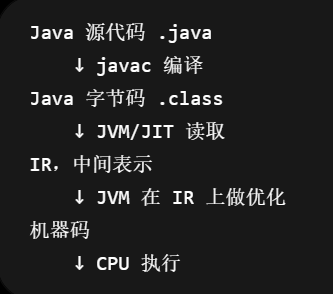

##### 为什么说Java语言编译和解释并存

编译型语言会通过编译器直接一次性将源代码编译为cpu可执行的机器码

解释型语言会通过解释器一句一句的把源代码翻译为机器码然后执行

对于java来说,它的编译性体现在把java代码编译为字节码

它的解释性体现在把字节码通过Java虚拟机解释为机器码然后执行

ps:

##### AOT有什么优点?为什么不全部使用AOT?

AOT是jdk9引入的一种编译方式,跟其他编译型语言一样,会在程序执行前就将其整个编译成机器码

AOT可以避免JIT预热的开销,提高java程序的启动速度,减少内存占用,增加java程序的安全性

但是使用AOT之后就无法使用java的一些动态特性,如反射,动态代理,动态加载,JNI等,而很多框架和库都用到了这些特性,自然也无法使用

ps:

JIT

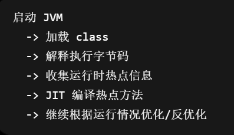

内存占用

启动速度

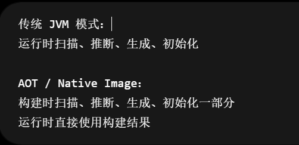

##### java和cpp的区别

java不提供指针来直接访问内存

java的类是单继承的,cpp可以多继承,java的接口是可以多继承的

java有自动的垃圾回收机制

cpp支持操作符重载,而java只支持方法重载

##### 8 种基本数据类型的默认值以及所占空间

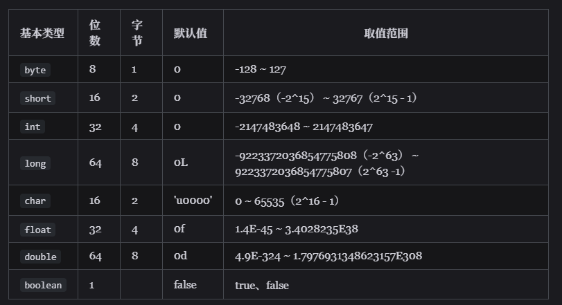

##### 包装类型的缓存机制

Byte,Short,Long,Integer,Character这五种包装类的前四种都实现了数值-128到127的缓存

Character实现了0-127的缓存

其中Integer的缓存上限可以通过虚拟机参数来修改

缓存的原理是包装类内部有一个静态内部类

静态内部类中有一个数组来保存缓存

当使用valueOf方法时,如果已经有缓存,就拿缓存的对象

但使用new方法创建时,没有缓存机制,直接在堆内存中创建对象

##### 自动拆箱和自动装箱

就拿int类型的包装了来说

自动拆箱和自动装箱在字节码角度来看

等价于valueOf方法和intValue方法

ps:

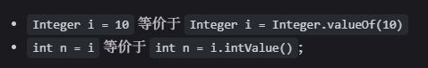

##### 为什么浮点数运算的时候会出现精度丢失

计算机使用二进制来存储数字,而且表示数字的宽度是有限的,十进制中有限位数的小数,用二进制表示可能是无限位数的,只能截断

因此比较浮点数的时候不能使用== 或者equals方法

而是应该规定一个误差范围

ps:

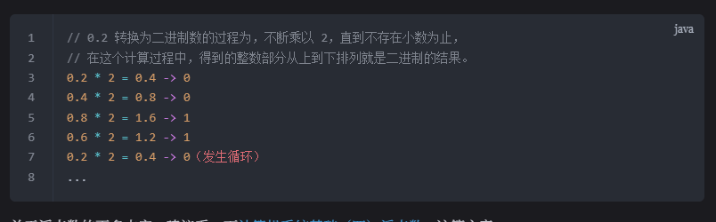

##### 如何解决精度丢失问题

大部分需要浮点数精确运算的场景使用bigDecimal来解决,比如涉及到钱的场景

关于bigDecimal :[BigDecimal 详解 | JavaGuide](https://javaguide.cn/java/basis/bigdecimal.html#bigdecimal-工具类分享)

##### 超过long整型的数据如何表示

可以使用bigInteger类表示

内部使用int[]数字来储存任意大小的整形数据

但相较于常规运算,bigInteger运算效率较低

##### 静态方法和实例方法

静态方法是属于类的

而实例方法是属于对象的

一般使用类名来调用静态方法

使用对象来调用实例方法

另外,对于静态方法而言

只能访问静态成员变量和静态方法

##### 重载和重写

重载发生在一个类的不同方法中

即不同方法的方法名可以相同,但是参数列表必须不同

总的来说就是一个类中的多个重名方法可以根据传入参数的不同来执行不同的逻辑

重写发生在父类和子类之间

子类可以重新编写父类的方法

并且要求子类重写方法的访问权限要大于等于父类

父类的私有方法是无法被子类重写的

##### 可变长参数

可变长参数就是运行调用方法的时候传入不定长度的参数

不定长参数必须放在参数列表的最后

在遇到方法重载的时候

会优先使用固定参数的方法

##### 面向对象和面向过程

面向对象会先从问题中抽象出对象,然后通过对象来执行方法解决问题

面向过程会把问题拆解成一个个方法,通过执行方法来解决问题

面向对象支持封装继承和多态,代码的可维护性,拓展性好,代码复用方便

面向过程更加简单直观

ps:

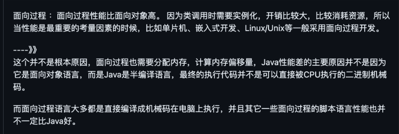

##### 面向对象三大特性

封装,继承和多态

1.封装是指我们把一些属性和方法包装在一个类中

只暴露一些接口给外界来访问我们的属性

2.继承是指子类通过继承父类

可以拥有父类所有的属性和方法

但是父类中的私有属性和方法子类无法访问

并且子类可以对父类进行拓展和重写

3.多态是指同一个接口,根据传入参数的不同,可以执行不同的逻辑

java中有三种典型的多态

第一个是用父类的引用指向子类

第二是用接口的引用指向实现类

前两个属于运行时多态

第三个是方法重载

属于编译时多态

这三个特点使得面向对象的代码可维护性,可拓展性好,代码复用方便

##### 接口和抽象类

接口和抽象类都无法被直接实例化成对象

接口是用来实现的,它描述的是这个对象能做什么

抽象类是用来继承的,它描述的是这个对象是什么

一个类只能继承一个类,但是可以实现多个接口

在java8之后,可以在接口中定义默认方法和静态方法,在Java9之后,可以定义私有方法

##### 深拷贝,浅拷贝,引用拷贝

浅拷贝是指,我们在堆中创建一个新的对象,对象的基本数据类型的字段会原封不动的复制过来,但是对于引用类型的字段,只会把字段的引用拷贝过来,也就是说,我们拷贝的对象和原对象的引用类型的字段指向同一个对象

深拷贝则会完整的复制整个对象,对于内部的引用类型的字段也会递归的进行拷贝

引用拷贝就只是把一个变量的引用赋值给另一个变量,这样两个变量的引用指向同一个对象

##### ==和equals()

对于基本数据类型,==比较的是值

对于引用数据类型,==比较的是引用

equals当打存在于object类中

所以所有类都有这个方法

如果类没有重写equals方法,那么等价于==

如果重写了,那自然按照重写的逻辑来进行比较

比如String就重写了euqals方法用来比较字符串是否相同

##### 为什么重写hashcode时必须重写equals方法

因为我们始终要保证,被equals判定为相等的两个值,他们的hashcode值也要相等

如果equals判定为相等的两个值hashcode值却不相等

那么在使用hashmap等哈希集合的时候会出现问题

因为两个被equals判定为相同的值应该被分到同一个哈希桶中

但是由于hashcode和equlas方法的不一致,他们可能会被分配不同的桶中

ps:

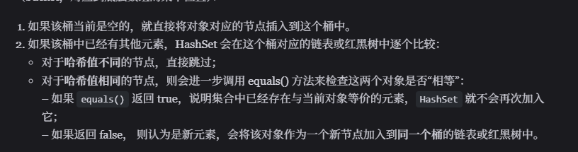

##### string,stringBuilder,stringBuffer的区别

三者内部都使用字符数组来保存字符串

string是不可变的

而后两者是可变的,支持追加插入等一系列修改操作

stringbuffer其实就是线程安全的stringBuilder

内部设计线程安全的方法使用sychornized注解修饰

##### string类是怎么保证自己不可变的

首先string类没有暴露方法来修改字符串数组,而字符串数组本身也是私有的

并且string类被final修饰,无法被继承,也就避免了子类修改字符串数组

##### 字符串拼接用"+号"还是stringbuilder?

少量几次拼接用+号

循环里大量拼接用 StringBuilder

因为java对+和+=进行了运算符重载

当使用+号拼接字符串的时候,实际上也是使用stringbuilder拼接

但是当循环进行拼接的时候,不会复用同一个stirngbuilder,而是每一次循环都会单独创建

##### 字符串常量池

字符串常量池是jvm中用来缓存字符串的区域,在堆内存中

当第一次使用的时候,会把使用到的字符串放进串池

也可以手动使用字符串的intern方法把字符串放进串池

之后使用的时候串池中已有的字符串时,会复用串池中的字符串

但使用new关键字创建的字符串,依然在堆内存中直接创建

注意点:

String a = "a" + "b"  a和b都不会进串池,"ab"会进,属于编译时连接

String a = "he";
String b = "llo";
String s4 = a + b;   hello不会进串池 

final String a = "he";
final String b = "llo";
String s4 = a + b;   hello进串池,编译时连接

String s = new String("aa") + new String("bb");
String t = s.intern();

JDK 6：如果池中没有，会复制一份进永久代，`s == t` 通常是 `false`。

JDK 7+：如果池中没有，会把 `s` 的引用放进池中，`s == t` 通常是 `true`。

题:

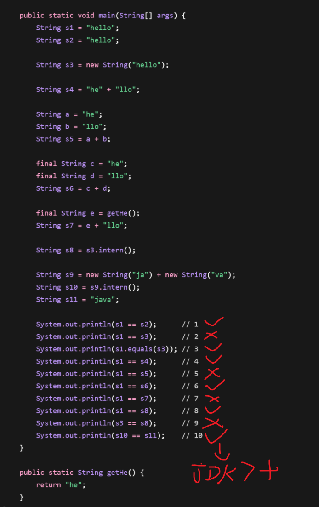

##### 异常家族继承关系图

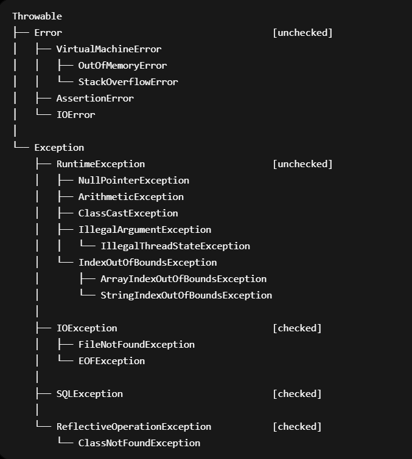

##### Exception和Error的区别

Exception和error都继承于Throwable

​	Exception是程序可以处理的异常,可以使用catch进行捕获

​		Exception分为受检异常和非受检异常,受检异常必须处理(否则无法通过编译)

​	Error是程序无法处理的异常,不建议使用catch捕获,比如OOM 栈内存溢出

##### 使用受检异常还是非受检异常

默认使用非受检异常,非受检异常可以看作是代码的bug,对待Bug,不推荐用try-catch来掩饰,而是暴露然后修复

只有在报错是业务逻辑的一部分的时候才使用受检异常,比如余额不足异常,我们用受检异常提醒调用者来处理这个业务分支

##### Throwable类的常用方法

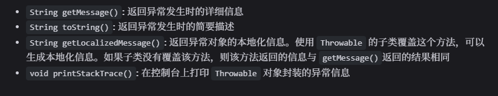

##### finally中的代码一定会执行吗

不一定,如果虚拟机被终止运行了,断电了,进程被终止,都不会被执行

ps:

finally块中的代码无论try块中的代码是否发生报错,都会执行

不推荐在finally中使用return 会导致try中的return被忽略

##### try with resources

能够自动关闭所有实现了autoCloseable接口的资源

ps:

使用方法

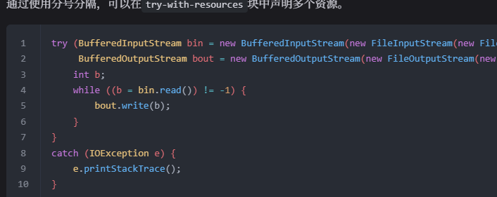

##### 泛型的使用方法

泛型一般有三种使用方式:**泛型类**、**泛型接口**、**泛型方法**。

通过使用泛型,能指定传入的对象类型

能避免我们手动转换返回值

##### API和SPI

API是由服务者定义并实现的,用来给用户提供能力

SPI是说我定义并提供一个服务接口,不同厂商来根据我的接口实现功能,那这种接口就叫SPI

##### 反射

反射就是Java提供的一套API

可以让我们在运行时

对于任意一个类,能获取类的所有属性和方法信息

对于任意对象,能调用它的任意方法,获取修改它的属性

反射在业务代码中很少使用

但是在框架中大量使用

比如spring通过配置文件动态加载bean用的是反射

jdk的动态代理也需要使用反射来调用目标对象的方法

反射的优点是灵活,但是性能相较于普通的方法调用来说比较低

但是他破坏了类的封装性,比如可以通过setAccessible(true),可以访问private属性

##### 注解的原理

注解本身是一种元数据和标记,不产生作用,执行逻辑的是反射和注解处理器

本质上是一种特殊的接口,java编译器会为其生成字节码

注解可以打在类,方法,字段,局部变量,方法参数上

并可以带有一些属性值

后面可以通过反射的方式动态获取类,方法,字段的注解和属性值,比如autowired

或者定义注解处理器,在编译阶段执行一些逻辑,比如Lombok

根据注解和属性执行一些逻辑

我们可以设定注解的生命周期

比如源码阶段  : 通常用来进行一些检查操作 override 和 供注解处理器使用 

字节码阶段  :  提供给一些字节码增强工具使用

运行时阶段  : 供反射使用 autowired

##### DTO,VO,PO,DAO....

首先pojo是父概念

VO是用来给前端看的

PO是存在数据库的

DAO是与数据库交互的

DTO是用来传输对象的,需要去掉冗余的字段

##### 动态代理

代理就是说我们不直接调用一个类的某些方法,而是通过代理类来调用,由代理类对被代理的类做一些增强和修饰

静态代理可能需要我们手写代理类,在编译期代理类就生成并固定下来

而动态代理是利用反射在运行期动态的创建代理对象

jdk的动态代理是依靠接口实现的

需要被代理的类实现一些接口

并且我们需要实现InvocationHandler接口

重写invoke方法实现具体的代理逻辑

之后我们通过Proxy类创建代理对象

代理对象会把所有的接口声明方法调用转发给invocationhandler处理

除了jdk自带的动态代理

常用的还有CGLIB

CGLIB不依赖接口而是直接操作字节码生成目标类的子类

性能比JDK的反射更好

但是对于final类和final方法就无法代理

##### 序列化

使用jdk默认的序列化接口需要类实现serializable接口

可以定义serialVersionUid来进行版本管理

可以使用transient关键字使部分字段跳过序列化

但是不推荐使用java默认的序列化,虽然方便

但是存在安全漏洞:可以有恶意代码被执行

无法跨语言传递,

序列化之后的流太大,性能低

推荐使用主流的序列化框架比如

fastJson jackson来实现序列化,序列化为json的好处是可读性强,没有复杂的协议

也可以使用protobuf等框架序列化为二进制,性能比较高,一般用于rpc框架

##### IO模型

java有三种IO模型

BIO NIO AIO

AIO使用的不多,原因是在Linux环境下性能不如NIO

BIO是同步阻塞模型

使用BIO时一个线程对应一个连接

如果需要同时处理多个连接,需要大量线程

NIO是同步非阻塞模型,通过selector轮询有哪些Channel有数据可读

通常一个线程就能管理上千个连接,tomcat 和 netty的NIO模式都是这么实现的

AIO是异步非阻塞模型,发起请求后直接返回,操作系统完成数据拷贝后再执行回调函数

##### Native方法

native方法是只声明,但不用Java实现的方法,通常是使用c/cpp实现的

native方法一般用于Java不方便实现的比较底层的API

比如线程的创建和管理

一些IO操作

System里的arraycopy

如何创建一个native方法

使用javac命令生成JNI头文件

其中有函数的声明

使用c/cpp实现这些函数

把c/cpp源码编译成库

使用System.loadLibrary()加载

# java集合

##### 迭代器

常见的集合类都可以通过iterator()方法获得迭代器

迭代器主要有三个方法

hasnext()

next()

remove()

增强for循环底层就是使用迭代器

但是增强for循环无法在遍历的时候安全的删除元素

所以需要删除元素的时候使用迭代器

此外

对于List集合有ListIterator

支持双向遍历,增加和修改元素

##### ArrayList和LinkedList

二者都实现了List接口

区别是底层的数据结构不一样

先说ArrayList

ArrayList底层基于动态数组实现

随机访问的时间复杂度是O(1)

但是插入的时间复杂度是O(n)

再说LinkedList

LinkedList底层基于链表实现

所以内存占用更大

随机访问是O(n)

头插的时候时间复杂度是O(1)

实际开发中大部分情况都使用arraylist

因为cpu对连续内存的缓存命中率更高

除非出现大量头插的情况

##### ArrayList中间插入真的慢吗?

arrayList在进行插入时,使用了System.arraycopy

这是一个native方法

底层用的时memmove,cpu对这种连续内存块的搬运做了很多优化

所以实际测试下来

ArrayList的性能更好

##### ArrayList扩容机制

当增加元素的时候会检查是否超出容量

如果已经超出就扩大为原容量的1.5倍

创建一个新的数组

把老数组拷贝过去

让elementData指向新数组

在可预测的要添加大量元素的时候

可以预分配合理的容量

避免大量扩容操作

##### java中线程安全的集合

java.util中的

Vector : 内部方法基本都经过synchronized修饰,类似加锁的arraylist

HashTable :大部分方法都经过synchronized修饰,类似加锁的HashMap

这两种集合基本很少使用

juc中的

ConcurrentHashMap :与hashTable不同的地方主要是加锁的粒度不同,在jdk1.7加的是分段式锁,每个段都相当于一个hashMap,都有自己的锁  在jdk1.8之后,加锁的粒度是桶级别的,就是每个哈希桶都有自己的锁,不同桶之间互不干扰

ConcurrentSkipListMap:基于跳表实现,可以在对数时间内实现增删查改,依靠CAS操作保证线程安全

CopyOnWriteArrayList 不保证强一致性,在进行写操作的时候,会先获取一把互斥锁,然后复制原数组,在新数组上完成写操作后,把引用指向新数组,对于读操作,不加锁,所以有可能读到旧数据

ConcurrentSkipListSet : 使用ConcurrentSkipListMap实现

CopyOnWriteArraySet : 使用动态数组实现,不保证强一致性

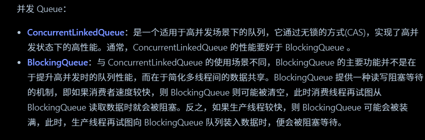

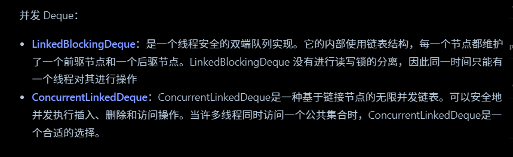

##### 为什么ArrayList不是线程安全的,怎么解决?

Arraylist添加数据可以抽象成三步

判断是否需要扩容

在size位置设置值

size++

在并发场景下增加数据可能出现以下情况

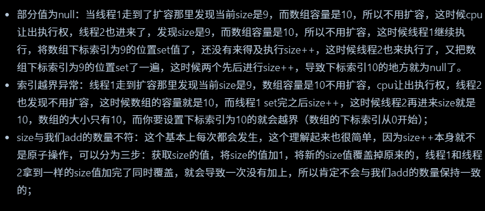

##### 怎么把ArrayList变得线程安全?

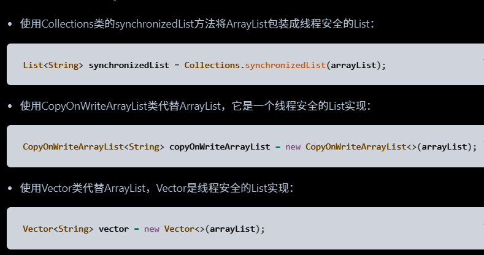

##### 有序的Set

TreeSet

底层是红黑树,插入时自动排序,需要元素实现Comparable接口或者自定义comparator

LinkedHashSet

底层是hashMap和双向链表

默认按照插入顺序排序

PS:

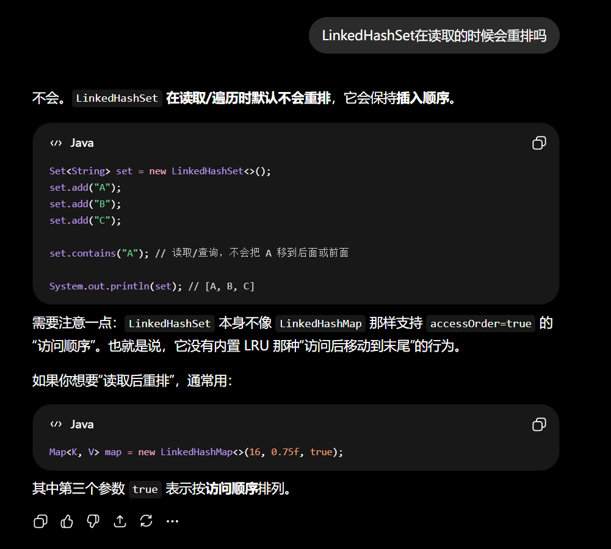

##### HashMap原理

hashMap底层使用数组和链表或者红黑树实现的

根据元素的hashCode来分配桶,如果发生冲突就使用拉链法建立链表

当链表长度>=8并且数组长度>=64的时候,就转化为红黑树

当某个桶中的元素过少,红黑树也会退化成链表

##### Put的过程

首先根据元素的hashcode函数获取哈希值

然后做一些扰动计算,减少哈希冲突

然后跟数组长度-1做与运算(因为数组的长度是2的幂,所以与运算相当于取模,但是效率高)

得到哈希桶的位置后

如果哈希桶是空的,放进哈希桶

如果是链表就从链表头部使用hashcode 和 equals方法依次比较

如果找到就替换value

如果没找到,就插入到链表尾部

如果是红黑树

就在红黑树中使用哈希值进行查找,查找到之后再用equals进行比较

如果找到,则替换value

如果没找到则作为叶子节点插入红黑树

之后可能涉及到红黑树的变色和旋转

然后检查链表的长度是否到达阈值

如果到达阈值并且数组长度大于64,则进行树化

最后检查负载因子是否超过阈值

如果超过则进行扩容

##### 扩容

HashMap默认的负载因子是0.75,如果元素超过了数组长度的75%,就发生扩容

扩容是会新建一个新数组,长度是原数组的两倍

然后进行哈希迁移

判断是否需要哈希迁移依靠的是位运算

和数组长度是2的幂有关

最后把引用指向新数组

##### 为什么不用平衡二叉树

平衡二叉树是严格平衡的

所以查找的时候确实会比红黑树更快一点

但是在进行插入删除的时候可能导致大量旋转操作,降低效率

所以应该说是一个均衡之选

##### HashMap是线程安全的吗?

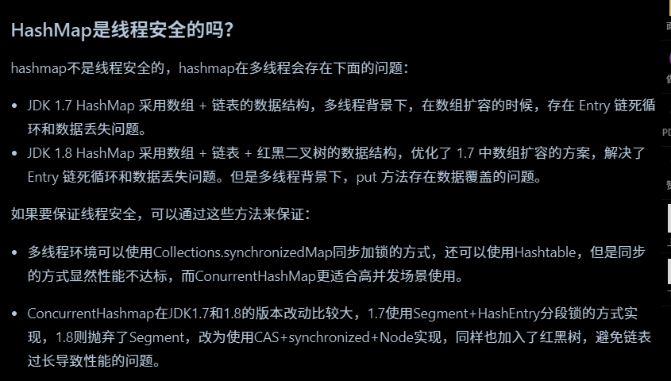

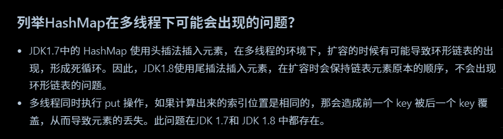

